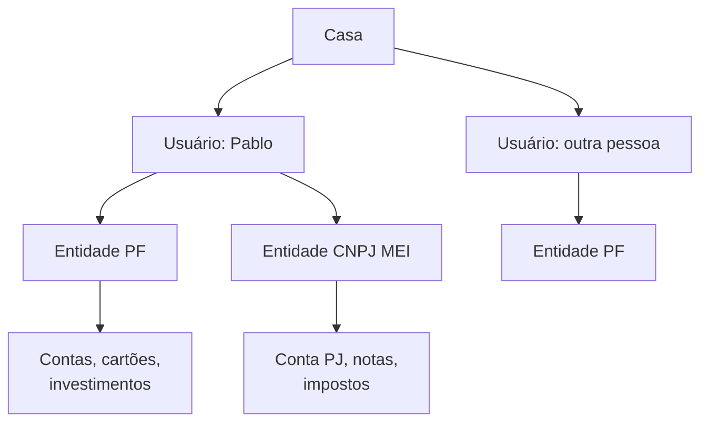
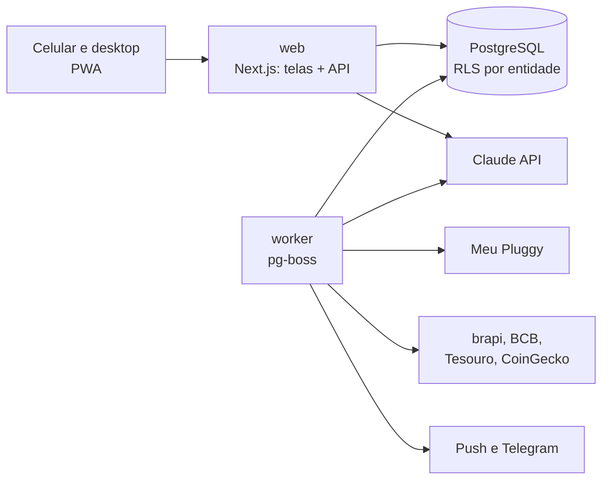
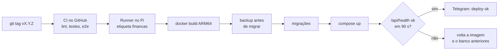

# Painel de Finanças — especificação do projeto

Sep 25, 2026 · @Pablo henrique

## Resumo

O **Finanças** é um painel web auto-hospedado no Raspberry Pi 5 que junta, para várias pessoas da mesma casa, contas bancárias, cartões, salário, investimentos e o CNPJ — com gráficos bonitos, alertas e uma IA que analisa, explica e projeta.

- **Pessoas:** cada usuário tem as próprias finanças; uma "casa" pode compartilhar contas e metas. Nada de uma pessoa aparece para outra sem permissão.
- **Pessoa física:** saldos por banco, gastos por categoria, fatura de cartão, orçamento, metas, patrimônio líquido, fluxo de caixa futuro.
- **Investimentos:** carteira completa (renda fixa, ações, FIIs, ETFs, Tesouro, cripto, previdência), rentabilidade contra CDI, IPCA e Ibovespa, proventos.
- **CNPJ:** faturamento, DAS, Fator R, pró-labore, quanto falta para o teto do regime (MEI ou Simples) e separação PF/PJ.
- **IA:** categoriza, acha gastos estranhos, gera relatório do mês, projeta saldo e patrimônio, simula decisões ("posso comprar X?") e responde perguntas em português.
- **Deploy:** Docker Compose no Pi, com HTTPS pela tailnet, backup criptografado e card no PiControl.

**Para o Claude Code:** este documento é a especificação. Construa na ordem da seção 12, fase por fase, e só avance quando os critérios de aceite da fase passarem. Valores fiscais (tetos, alíquotas, tabelas) ficam em tabelas do banco com vigência, nunca fixos no código.

> O painel organiza e simula; não substitui contador nem assessor de investimentos. As telas de impostos mostram esse aviso.

## 1. Várias pessoas

O sistema tem três níveis: **usuário** (quem faz login), **entidade** (quem tem o dinheiro: uma pessoa física ou um CNPJ) e **casa** (um grupo que compartilha parte das finanças). Um usuário pode ter várias entidades, por exemplo a PF do Pablo e o MEI dele.



### Papéis

| Papel | Pode | Não pode |
| --- | --- | --- |
| Dono da casa | tudo, convidar e remover membros, ver o consolidado da casa | ver contas privadas dos outros |
| Membro | gerenciar as próprias entidades, compartilhar contas e metas com a casa | ver o que não foi compartilhado |
| Leitor | ver o que foi compartilhado com ele | alterar qualquer coisa |
| Contador | ver e exportar só a entidade CNPJ para a qual foi convidado | ver a pessoa física |

### Compartilhamento por conta

- Cada conta, cartão ou investimento tem visibilidade: **privada**, **só saldo** (a casa vê o total, não as transações) ou **compartilhada** (a casa vê tudo).
- Visão **Casa**: soma apenas o que foi compartilhado; cada número mostra de quem vem.
- **Despesas divididas:** uma compra pode ser dividida entre membros (50/50, por valor ou por percentual), com o saldo de "quem deve quem" e botão de acerto.
- **Metas conjuntas** (viagem, reserva da casa) com contribuição de cada membro.
- Convite por link com validade de 48 h; cada pessoa cria a própria senha e passkey.

### Regras de privacidade no código

- Toda consulta ao banco filtra por entidade autorizada no servidor (Row Level Security do Postgres), nunca só na tela.
- A IA recebe apenas dados que o usuário da conversa pode ver.
- Teste automatizado obrigatório: o usuário B nunca lê transações privadas do usuário A, por nenhuma rota.

## 2. Finanças pessoais

A pessoa física tem onze módulos; o centro de tudo é a **transação**, que sempre pertence a uma conta, tem categoria e pode ter tags, anexo, divisão e parcela.

| Módulo | O que faz | Detalhes importantes |
| --- | --- | --- |
| Contas | corrente, poupança, carteira digital, dinheiro, vale-refeição/alimentação, conta em dólar | saldo por banco, logo do banco, saldo conciliado x informado |
| Multimoeda | contas e receitas em USD ou EUR | conversão pela PTAX do dia, registro de câmbio, spread e IOF de cada remessa |
| Cartões | faturas abertas e fechadas, limite, fechamento e vencimento | **parcelas futuras comprometidas** mês a mês, melhor dia de compra, compras internacionais com IOF |
| Transações | lista com busca, filtros e edição em massa | transferência entre contas não conta como gasto; estornos; Pix; anexar comprovante |
| Categorias | árvore de 2 níveis (Moradia › Energia) com ícone e cor | regras automáticas ("contém UBER → Transporte › App") + IA quando nenhuma regra casa |
| Renda | salário, pró-labore, distribuição de lucros, freelas, renda do exterior | holerite detalhado: bruto, INSS, IRRF, descontos, líquido; histórico de reajustes |
| Recorrências | contas fixas e assinaturas | detectadas automaticamente; alerta de aumento de preço e de assinatura esquecida |
| Orçamento | limite por categoria por mês | modos: por categoria, 50/30/20 ou envelopes; sobra passa para o mês seguinte (opcional) |
| Metas | reserva de emergência, viagem, compra, aposentadoria | aporte mensal necessário, data prevista, reserva medida em meses de custo de vida |
| Patrimônio | ativos e passivos | imóveis, veículos (valor FIPE), financiamentos e empréstimos com tabela Price ou SAC e saldo devedor |
| Agenda | contas a pagar e a receber | calendário, lembretes no Telegram e no push, saldo projetado dia a dia |

### Números que o painel sempre mostra

- **Patrimônio líquido** (ativos − passivos) e a variação no mês e no ano.
- **Taxa de poupança** do mês: (renda − gastos) ÷ renda.
- **Custo de vida médio** dos últimos 3, 6 e 12 meses, e quantos meses a reserva cobre.
- **Comprometido nos próximos meses:** parcelas, financiamentos e contas fixas.
- **Gasto do mês x orçamento x mesmo período do mês passado.**

### Imposto de renda da pessoa física

- Relatório anual pronto para a declaração: rendimentos por fonte, despesas dedutíveis (saúde, educação), bens e direitos com saldo em 31/12, lucro isento e parcela tributável do MEI.
- Renda do exterior recebida como pessoa física: controle mensal para o carnê-leão, com câmbio do dia do recebimento.
- Investimentos: ganho de capital por mês, isenção de vendas até o limite mensal de ações, DARF a pagar.

## 3. Investimentos

A carteira é calculada a partir das **operações** (compra, venda, provento, evento), nunca de saldos digitados, para que preço médio, rentabilidade e imposto saiam certos.

### Classes de ativo

| Classe | Como é avaliada | Particularidades |
| --- | --- | --- |
| Renda fixa (CDB, LCI, LCA, debêntures, CRI, CRA) | na curva, pelo indexador: prefixado, % do CDI, IPCA + taxa | vencimentos, carência, isenção de IR (LCI/LCA), exposição ao FGC por instituição |
| Tesouro Direto | preço de mercado do Tesouro e valor na curva | Selic, Prefixado, IPCA+, Renda+, Educa+ |
| Ações, FIIs, ETFs, BDRs | cotação de fechamento da B3 | proventos, desdobramento, grupamento, bonificação, subscrição |
| Fundos | cota diária | come-cotas, taxa de administração |
| Exterior | ações e ETFs em USD | câmbio na compra e na venda, dividendos com imposto retido |
| Cripto | preço de mercado em BRL e USD | custo médio por moeda, carteiras e corretoras |
| Previdência (PGBL, VGBL) | saldo informado ou extrato | regime de tributação, dedução do PGBL no IR |
| Outros | valor informado | imóveis para investimento, participações |

### Indicadores e gráficos

- **Rentabilidade** por ativo, por classe e total: no mês, no ano, em 12 meses e desde o início. Usar TWR (retorno por cota, comparável com índices) e XIRR (retorno do seu dinheiro, considerando aportes).
- **Contra benchmarks:** CDI, IPCA, IPCA + meta real, Ibovespa, IFIX e S&P 500 em BRL, no mesmo gráfico.
- **Alocação** atual x alocação alvo por classe, setor, indexador, liquidez e moeda.
- **Rebalanceamento:** "com o aporte de R$ X, compre isto" para chegar mais perto do alvo sem vender.
- **Proventos:** calendário, total por mês e por ano, dividend yield da carteira, renda passiva mensal média.
- **Vencimentos** de renda fixa nos próximos 24 meses.
- **Risco:** concentração por ativo e por emissor, volatilidade, maior queda (drawdown).

### Impostos dos investimentos

- Apuração mensal de ações, FIIs, ETFs e exterior: ganho, prejuízo acumulado para compensar, isenção de vendas de ações até o limite mensal, DARF a pagar com código e vencimento.
- Tabelas de IR (regressiva da renda fixa, alíquotas por classe) guardadas com data de vigência, porque as regras mudam.

### Independência financeira

Simulação de aposentadoria: com o aporte mensal, a rentabilidade real esperada e o custo de vida desejado, em que idade o patrimônio cobre as despesas. Mostrar um cenário pessimista, um base e um otimista, e a simulação de Monte Carlo da seção 6.

## 4. CNPJ: ME no Simples e MEI

O CNPJ do Pablo é **MEI**, então o módulo nasce focado nele: faturamento contra o teto de R$ 81 mil, DAS-MEI fixo, DASN-SIMEI, lucro isento para o IRPF e um simulador de quando vale migrar para ME. O cálculo do Simples (Anexos III e V, Fator R) fica pronto para essa migração e para outros usuários com ME. Os valores abaixo são os vigentes em setembro de 2026 e entram como dados com vigência.

### Tetos e limites

| Regime | Limite anual | Regras de cálculo |
| --- | --- | --- |
| MEI | R$ 81.000,00 | no ano de abertura, R$ 6.750 × meses de atividade; excesso de até 20 % (R$ 97.200) muda o regime só em janeiro; acima disso, desenquadramento retroativo |
| Simples Nacional (ME e EPP) | R$ 4.800.000,00 | acima de R$ 3.600.000,00, ISS e ICMS saem do DAS e são pagos à parte |

Propostas de aumento do teto do MEI (PLP 67/2025, para R$ 150 mil, e PLP 60/2025, "Super MEI", para R$ 140 mil) ainda não foram aprovadas; o painel deve permitir cadastrar um novo teto com data de vigência sem mudar código ([Contabilizei](https://www.contabilizei.com.br/contabilidade-online/faturamento-mei-2026/)).

Indicadores do teto: faturamento acumulado no ano e em 12 meses, percentual usado, quanto falta em R$, média mensal máxima para não estourar até dezembro e **data prevista para atingir o teto** no ritmo atual.

### MEI: o que o painel controla

| Item | Valor em 2026 | Como o painel usa |
| --- | --- | --- |
| DAS-MEI de serviços | R$ 86,05 por mês (INSS de R$ 81,05 = 5 % do salário mínimo de R$ 1.621 + ISS de R$ 5) | lançamento recorrente automático, vencimento dia 20, alerta de atraso ([Receita Federal](https://www8.receita.fazenda.gov.br/simplesnacional/noticias/NoticiaCompleta.aspx?id=c3b2044c-ff97-432a-b33c-ecf2a3df6dc3)) |
| DAS-MEI de comércio ou indústria | R$ 82,05 (INSS + ICMS de R$ 1) | escolhido pela atividade do MEI |
| Comércio e serviços juntos | R$ 87,05 | idem |
| Média mensal máxima | R$ 6.750 | barra do mês atual e do acumulado contra a média |

- **Receita em dólar:** cada nota do contrato no exterior é convertida pelo câmbio do recebimento; o painel mostra quanto uma alta do dólar aproxima o teto e avisa se a projeção do ano passar de R$ 81 mil.
- **Faixas de alerta:** 70 % do teto (atenção), 90 % (planejar a migração), 100 % a 120 % (vai virar ME em janeiro) e acima de 120 % (desenquadramento retroativo — falar com o contador já).
- **DASN-SIMEI:** declaração anual até 31 de maio, com o faturamento do ano pronto para copiar.
- **Nota fiscal:** registro das NFS-e emitidas no Emissor Nacional (importação do XML).
- **Lucro isento no IRPF:** o painel calcula o lucro do ano (receitas − despesas do MEI), a parcela isenta (32 % da receita de serviços, 8 % de comércio) e a parcela tributável que vai na declaração da pessoa física.
- **Regras do MEI** como checagens: no máximo 1 empregado, atividade permitida, sem sócio.

### Quando vale migrar para ME

O simulador compara, com o faturamento projetado para os próximos 12 meses: DAS-MEI × 12 contra o DAS do Simples (Anexo III com Fator R ou Anexo V), mais o custo do contador e o INSS do pró-labore. Mostra o ponto em que o MEI deixa de caber e o custo mensal total em cada cenário, para decidir a migração antes de estourar o teto.

### Depois da migração para ME: DAS do Simples (Anexos III e V)

Desenvolvimento de software (CNAE 6201-5/01) fica no **Anexo V**, mas vai para o **Anexo III** quando o Fator R é de pelo menos 28 %. A alíquota efetiva usa a receita bruta dos últimos 12 meses (RBT12):

```latex
\text{alíquota efetiva} = \frac{RBT12 \times \text{alíquota nominal} - \text{parcela a deduzir}}{RBT12}
```

```latex
\text{Fator R} = \frac{\text{folha de salários dos últimos 12 meses (inclui pró-labore)}}{RBT12}
```

| Faixa (RBT12) | Anexo III: alíquota | Anexo III: deduzir (R$) | Anexo V: alíquota | Anexo V: deduzir (R$) |
| --- | --- | --- | --- | --- |
| até 180.000,00 | 6,00 % | 0 | 15,50 % | 0 |
| 180.000,01 a 360.000,00 | 11,20 % | 9.360,00 | 18,00 % | 4.500,00 |
| 360.000,01 a 720.000,00 | 13,50 % | 17.640,00 | 19,50 % | 9.900,00 |
| 720.000,01 a 1.800.000,00 | 16,00 % | 35.640,00 | 20,50 % | 17.100,00 |
| 1.800.000,01 a 3.600.000,00 | 21,00 % | 125.640,00 | 23,00 % | 62.100,00 |
| 3.600.000,01 a 4.800.000,00 | 33,00 % | 648.000,00 | 30,50 % | 540.000,00 |

Fontes das tabelas: [Contabilizei — Anexo III](https://www.contabilizei.com.br/contabilidade-online/anexo-3-simples-nacional/) e [eSimples — Anexo V](https://blog.esimplesauditoria.com.br/anexo-5-do-simples-nacional/). A repartição de cada alíquota entre IRPJ, CSLL, COFINS, PIS, CPP e ISS vem das tabelas de partilha da LC 123/2006 e também fica no banco.

### Receita de exportação de serviços

Para cliente no exterior, com o resultado fora do Brasil e entrada de divisas, a receita é marcada como exportação: o painel retira do DAS a parcela de PIS e COFINS ([Solução de Consulta COSIT 160/2024](https://tributodevido.com.br/portal/exportacao-de-servicos-no-simples-nacional-4/)) e a de ISS (LC 116/2003, art. 2º). Guardar por nota: país do cliente, moeda, câmbio usado e comprovante do contrato de câmbio. **Confirmar o enquadramento com o contador** antes de usar os números para pagar.

### Otimizador de Fator R e pró-labore

O painel sugere o pró-labore mínimo para manter o Fator R em 28 % e compara o custo (INSS de 11 % do sócio e IRRF) com a economia no DAS. Exemplo ilustrativo, com RBT12 de R$ 240.000 e faturamento de R$ 20.000 no mês:

| Cenário | Alíquota efetiva | DAS do mês | Custo extra de pró-labore |
| --- | --- | --- | --- |
| Anexo V (Fator R abaixo de 28 %) | 16,13 % | R$ 3.225 | — |
| Anexo III (pró-labore de R$ 5.600/mês) | 7,30 % | R$ 1.460 | INSS de R$ 616 + IRRF conforme a tabela |

O cálculo também simula a meta de retirada líquida mensal e divide entre pró-labore e distribuição de lucros.

### Lucros e as regras novas de 2026

- Lei 15.270/2025: distribuição de lucros acima de **R$ 50 mil por mês**, da mesma empresa para a mesma pessoa, tem **IRRF de 10 %**, inclusive no Simples; e há imposto mínimo para quem recebe mais de R$ 600 mil por ano ([Demarest](https://www.demarest.com.br/receita-federal-divulga-perguntas-e-respostas-sobre-a-nova-tributacao-de-dividendos-e-altas-rendas/)). O painel avisa antes de um Pix que passaria do limite no mês.
- Lucro distribuível do mês: receitas − despesas − impostos − pró-labore, com sugestão de reserva de caixa da empresa.

### Outras telas do CNPJ

- **Notas fiscais:** importação do XML da NFS-e, receita por cliente, país e moeda.
- **Clientes:** concentração de receita (alerta se um cliente passa de 70 %), prazos médios, faturas a receber.
- **DRE simplificada** mensal e anual, despesas da empresa por categoria, fluxo de caixa PJ.
- **Provisão de impostos:** cada recebimento já separa o percentual estimado do DAS e mostra o saldo "livre" da conta PJ.
- **Separação PF e PJ:** transferências PJ → PF classificadas como pró-labore, lucro ou reembolso; alerta quando a conta PJ paga um gasto pessoal.
- **Calendário fiscal:** DAS (dia 20), DASN-SIMEI (MEI, maio), DEFIS (Simples, março), INSS do pró-labore, IRPF, com lembretes.
- **Pacote do contador:** exportação mensal em PDF e planilha para o papel Contador da seção 1.

## 5. Entrada de dados

A entrada automática principal é o **Open Finance pelo Meu Pluggy**, gratuito para uso pessoal, com importação de arquivos como reserva e APIs públicas para cotações e índices. Toda importação passa pela mesma fila: deduplicar, categorizar, conciliar.

### Contas e cartões

| Fonte | Como funciona | Limites e cuidados |
| --- | --- | --- |
| Meu Pluggy (Open Finance) | cada pessoa cria a própria conta em meu.pluggy.ai, conecta os bancos e cola o Client ID e o Secret no painel; o painel busca saldos, extratos, cartões e investimentos | gratuito, até 5 conexões ativas, só contas do próprio titular, uso pessoal, atualização a cada 24 h ([Meu Pluggy](https://www.pluggy.ai/meu-pluggy)) |
| OFX | arquivo exportado pelo internet banking | padrão na maioria dos bancos; bom para histórico antigo |
| CSV por banco | modelos prontos (Nubank, Inter, C6, Itaú, BB) e um mapeador de colunas genérico | o usuário salva o mapeamento para reutilizar |
| PDF de fatura ou extrato | a IA extrai as linhas e o usuário confirma antes de gravar | nunca grava sem revisão |
| Lançamento rápido | formulário de 3 campos, bot do Telegram ("gastei 45 no ifood") e foto do comprovante lida pela IA | ideal para dinheiro e Pix fora do Open Finance |

As conexões do Meu Pluggy são por titular, então **cada pessoa guarda as próprias credenciais**, criptografadas e visíveis só para ela. Para uso comercial ou mais conexões, os planos pagos da Pluggy e de outros agregadores custam na faixa de milhares de reais por mês, o que não faz sentido aqui.

### Investimentos

| Fonte | O que traz |
| --- | --- |
| Meu Pluggy | posições e saldos de investimentos das instituições conectadas |
| Área do Investidor da B3 | planilhas de negociação, movimentação e posição (importação de .xlsx), inclusive proventos e eventos |
| Notas de corretagem em PDF | extração pela IA, com revisão |
| Corretoras de cripto | CSV das exchanges ou chave de API somente leitura |

### Cotações e índices

| Dado | Fonte | Observação |
| --- | --- | --- |
| Ações, FIIs, ETFs, BDRs, proventos | brapi.dev | plano gratuito com 15 mil requisições por mês e 1 requisição simultânea: buscar em lote uma vez por dia após o pregão ([brapi](https://brapi.dev/faq/tem-algum-limite)) |
| CDI, Selic, IPCA, IGP-M | API de séries temporais (SGS) do Banco Central | séries diárias e mensais, sem chave |
| Dólar e euro (PTAX) | API de câmbio do Banco Central | usada na conversão de receitas e compras em moeda estrangeira |
| Tesouro Direto | arquivos de preços e taxas do Tesouro Transparente | preço de mercado diário dos títulos |
| Cripto | CoinGecko (API pública) | preço em BRL e USD |
| Veículos | tabela FIPE | atualização mensal do patrimônio |

### Regras da fila de importação

- **Deduplicação** por conta + data + valor + descrição normalizada + id externo; nunca criar a mesma transação duas vezes quando o Open Finance e um OFX se sobrepõem.
- **Conciliação:** saldo calculado x saldo do banco por dia; diferença vira alerta.
- **Transferências internas:** saída numa conta e entrada de mesmo valor em outra em até 2 dias viram uma transferência, não gasto e receita.
- **Histórico:** cada importação fica registrada e pode ser desfeita por inteiro.

## 6. IA: análises, projeções e conversa

A IA usa o Claude pela API com **ferramentas fechadas** (funções que o servidor executa com as permissões do usuário), nunca SQL livre; tudo o que ela afirma vem de números calculados pelo sistema e vem com as transações de origem.

### Recursos

| Recurso | Como funciona | Quando roda |
| --- | --- | --- |
| Categorização | regras do usuário → histórico de descrições parecidas → modelo pequeno em lote; aprende com cada correção | a cada importação |
| Alertas inteligentes | gasto fora do padrão da categoria, cobrança duplicada, assinatura que subiu, tarifa bancária, juros e IOF | a cada importação |
| Relatório do mês | texto curto com o que mudou, 3 gráficos e 3 ações sugeridas | dia 1, push e Telegram |
| Resumo da semana | gasto da semana, orçamento restante, contas dos próximos 7 dias | domingo à noite |
| Pergunte às suas finanças | chat com respostas, gráficos embutidos e links para as transações | sob demanda |
| Projeções | saldo dos próximos 90 dias, patrimônio em 1, 5 e 10 anos, teto do CNPJ, IR do ano | diário, com cache |
| Simulações | "posso comprar X em 10×?", "e se eu subir o pró-labore?", "financiar ou à vista?", "quitar a dívida antes?" | sob demanda |
| Leitura de documentos | PDF de fatura, nota de corretagem, holerite e foto de comprovante viram dados para revisão | no upload |

### Ferramentas que a IA pode chamar

`gastos(periodo, categoria?, conta?)` · `receitas(periodo, fonte?)` · `saldos(data?)` · `fatura(cartao, mes)` · `parcelas_futuras()` · `orcamento(mes)` · `metas()` · `carteira(data?)` · `rentabilidade(periodo, benchmark)` · `proventos(periodo)` · `cnpj_resumo(ano)` · `das_estimado(mes)` · `fator_r(prolabore?)` · `projetar_fluxo(dias)` · `simular_compra(valor, parcelas, data)` · `monte_carlo(aporte, anos, perfil)` · `buscar_transacoes(texto, periodo)`

Todas são somente leitura; criar metas, regras ou orçamentos a partir do chat gera uma **proposta** que o usuário confirma com um toque.

### Como as projeções são calculadas

- **Fluxo de caixa:** saldo atual + recorrências conhecidas + parcelas + salário previsto + média sazonal dos gastos variáveis (mesmo mês do ano anterior pesa mais), com faixa de confiança.
- **Patrimônio:** Monte Carlo com 5.000 cenários por classe de ativo (retorno e volatilidade históricos configuráveis), mostrando os percentis 10, 50 e 90.
- **Teto do CNPJ:** média móvel de 3 e 6 meses do faturamento, com a data prevista para 80 % e 100 % do teto.
- **IR do ano:** imposto estimado da PF e do CNPJ até dezembro, com o que já foi pago.

### Custos, privacidade e limites

- Modelo pequeno e barato para categorizar e extrair; modelo maior só para relatórios e chat; respostas em cache.
- Teto de gasto mensal com a API por casa, com o consumo visível nas configurações.
- Antes de enviar: remover CPF, CNPJ, números de conta e nomes de terceiros das descrições.
- Cada usuário liga ou desliga a IA para as próprias finanças; opção de categorização local (modelo pequeno no Pi) sem nada sair de casa.
- Toda resposta sobre impostos e investimentos termina com o lembrete de que é uma estimativa e não recomendação.

## 7. Telas, gráficos e visual

O visual segue três princípios: **números grandes e legíveis**, **uma cor por significado** (entrada, saída, investimento, imposto) e **menos é mais** — cada tela responde uma pergunta. Primeiro o celular (PWA), depois o desktop com mais colunas.

### Identidade visual

- Tema escuro como padrão e tema claro completo; cores definidas como tokens (`--entrada`, `--saida`, `--invest`, `--imposto`, `--alerta`), testadas para contraste nos dois temas.
- Tipografia Inter ou Geist com números tabulares, para os valores alinharem nas tabelas.
- Formato brasileiro sempre: R$ 1.234,56, 25/09/2026, percentuais com vírgula.
- **Modo privacidade:** um toque borra todos os valores (para abrir o app em público).
- Cards com cantos de 16 px, sombras suaves, esqueletos de carregamento e transições de 150–250 ms.
- Ícones e logos dos bancos, das categorias e dos ativos.

### Telas e gráficos

| Tela | Pergunta que responde | Gráficos e componentes |
| --- | --- | --- |
| Início | como estou este mês? | patrimônio líquido com sparkline, gasto x orçamento, saldo projetado de 30 dias, alertas, contas da semana |
| Fluxo | para onde vai o dinheiro? | **Sankey** renda → categorias → subcategorias; cascata do mês (saldo inicial, entradas, saídas, saldo final) |
| Gastos | com o que gasto mais? | treemap por categoria, barras empilhadas por mês (12 meses), **calendário de calor** com o gasto de cada dia, top estabelecimentos |
| Contas e cartões | quanto tenho em cada banco e quanto devo? | saldo por banco, fatura atual e próximas, **parcelas futuras** em barras por mês, limite usado |
| Orçamento | estou dentro do plano? | barras de progresso por categoria com o ritmo ideal do mês marcado |
| Metas | quando chego lá? | progresso, aporte necessário, data prevista |
| Patrimônio | estou ficando mais rico? | área empilhada de ativos e passivos ao longo do tempo |
| Investimentos | minha carteira está indo bem? | rentabilidade acumulada x CDI, IPCA e Ibovespa (linhas); alocação atual x alvo (barras lado a lado); proventos por mês; vencimentos |
| Aposentadoria | quando posso parar? | **leque de Monte Carlo** (percentis 10, 50, 90) com a linha do patrimônio necessário |
| CNPJ | como está a empresa? | faturamento mensal, **medidor do teto** com projeção, DAS por mês, Fator R ao longo do tempo com a linha de 28 %, DRE |
| Impostos | quanto vou pagar? | calendário fiscal, DAS e DARF a pagar, simulador de pró-labore |
| Casa | como está a família? | consolidado compartilhado, contribuição de cada membro, "quem deve quem" |
| Transações | onde está aquela compra? | busca instantânea, filtros salvos, edição em massa |
| Assistente | pergunte qualquer coisa | chat com gráficos embutidos e sugestões de perguntas |

### Regras dos gráficos

- Biblioteca: **Apache ECharts** (tem Sankey, treemap, calendário, leque e aguenta muitos pontos no celular).
- Toda série de tempo tem seletor de período (1M, 3M, 6M, 1A, 5A, tudo) e tooltip com valor e variação.
- Clicar num pedaço do gráfico abre as transações daquele pedaço.
- Nada de pizza com mais de 5 fatias; acima disso, barras ordenadas.
- Cada gráfico tem estado vazio explicativo ("conecte um banco para ver isto").

### Detalhes de experiência

- Onboarding em 4 passos: criar entidade PF, conectar o primeiro banco, revisar categorias, definir uma meta.
- Paleta de comandos (Ctrl+K) e atalhos: `n` nova transação, `/` busca.
- Barra inferior no celular: Início, Gastos, Investimentos, CNPJ, Mais.
- Notificações push (PWA) e Telegram, configuráveis por tipo.
- Tudo acessível por teclado e leitor de tela; alvos de toque de 44 px.

## 8. Arquitetura e stack

Uma aplicação **TypeScript de ponta a ponta** (Next.js) com **PostgreSQL** e um **worker** de tarefas em segundo plano, tudo em Docker Compose no Pi; sem Redis nem serviços extras, porque a fila também mora no Postgres.



### Escolhas

| Camada | Escolha | Motivo |
| --- | --- | --- |
| Front e API | Next.js (App Router) + TypeScript | uma base só, renderização no servidor rápida no celular |
| Componentes | Tailwind CSS + shadcn/ui | bonito, acessível e fácil de manter no mesmo padrão |
| Gráficos | Apache ECharts | Sankey, treemap, calendário e leque prontos |
| Banco | PostgreSQL + Drizzle ORM | Row Level Security para isolar pessoas; migrações versionadas |
| Autenticação | Better Auth | e-mail e senha, passkeys, 2FA por aplicativo, convites |
| Fila e agendamentos | pg-boss | tarefas e cron dentro do Postgres |
| Validação | Zod | mesmo esquema na API, nos formulários e nas ferramentas da IA |
| IA | SDK da Anthropic | modelos configuráveis por tarefa |
| Testes | Vitest e Playwright | cálculos fiscais com casos fixos; fluxos de tela no celular |

### Regras de dinheiro no código

- Valores em **centavos inteiros** (`bigint`) mais o código da moeda; nunca `float`.
- Quantidades de ativos e cotações em `numeric(24,8)`.
- Conversão de moeda sempre registra a taxa usada e a data.
- Arredondamento só na exibição, com o formato pt-BR.
- Toda regra fiscal (tetos, tabelas do Simples, partilha, IR) em tabelas com `vigente_de` e `vigente_ate`; os cálculos recebem a data e escolhem a tabela certa.

### Organização do repositório

```
financas/
  apps/web/          telas, rotas de API, PWA
  apps/worker/       importações, cotações, IA, alertas
  packages/core/     cálculos puros: impostos, rentabilidade, projeções (100 % testados)
  packages/db/       esquema Drizzle, migrações, políticas RLS, sementes fiscais
  packages/importers/ OFX, CSV por banco, B3, Pluggy
  deploy/            docker-compose.yml, backup, scripts do Pi
  .github/workflows/ CI, build ARM64, release, deploy no runner do Pi
```

## 9. Modelo de dados

Todas as tabelas de dinheiro têm `entidade_id` e uma política RLS que só libera a linha para quem tem acesso àquela entidade; as tabelas de referência (índices, cotações, regras fiscais) são globais e somente leitura para usuários.

### Pessoas e acesso

| Tabela | Campos principais |
| --- | --- |
| usuarios | id, nome, email, idioma, preferências, ia\_ativa |
| casas | id, nome, moeda\_base |
| membros\_casa | casa\_id, usuario\_id, papel (dono, membro, leitor) |
| entidades | id, dono\_id, tipo (PF ou PJ), nome, documento (criptografado), regime (MEI, Simples ME, Simples EPP), anexo, cnae, municipio, data\_abertura |
| acessos\_entidade | entidade\_id, usuario\_id, papel (membro, leitor, contador) |

### Dinheiro

| Tabela | Campos principais |
| --- | --- |
| instituicoes | id, nome, codigo\_compe, logo |
| contas | id, entidade\_id, instituicao\_id, tipo (corrente, poupança, carteira, dinheiro, benefício, investimento, cartão), moeda, visibilidade (privada, só saldo, compartilhada), fechamento, vencimento, limite\_centavos |
| transacoes | id, conta\_id, data, descricao\_original, descricao, valor\_centavos, moeda, taxa\_cambio, categoria\_id, tipo (gasto, receita, transferência, estorno), transferencia\_par\_id, parcela\_n, parcela\_total, compra\_id, origem (pluggy, ofx, csv, manual, ia), id\_externo, importacao\_id, notas |
| divisoes | transacao\_id, usuario\_id, valor\_centavos, acertado\_em |
| categorias | id, entidade\_id (nulo = padrão), pai\_id, nome, icone, cor, tipo |
| regras\_categoria | id, entidade\_id, condicao (texto, valor, conta), categoria\_id, prioridade |
| tags, transacao\_tags | etiquetas livres |
| anexos | id, transacao\_id, arquivo, tipo |
| recorrencias | id, entidade\_id, descricao, valor\_estimado, frequencia, proxima\_data, conta\_id |
| orcamentos | entidade\_id, mes, categoria\_id, limite\_centavos, modo |
| metas | id, entidade\_id ou casa\_id, nome, alvo\_centavos, data\_alvo, contas\_vinculadas |
| saldos\_diarios | conta\_id, data, saldo\_centavos, origem (calculado ou banco) |
| importacoes | id, entidade\_id, fonte, arquivo, status, linhas, desfeita\_em |
| conexoes\_pluggy | id, usuario\_id, client\_id, client\_secret (criptografado), item\_ids, ultima\_sync |

### Investimentos

| Tabela | Campos principais |
| --- | --- |
| ativos | id, ticker ou nome, classe, emissor, indexador, taxa, vencimento, moeda, isento\_ir |
| operacoes | id, conta\_id, ativo\_id, data, tipo (compra, venda, provento, juros, amortização, evento), quantidade, preco, taxas\_centavos, ir\_retido\_centavos |
| eventos\_corporativos | ativo\_id, data, tipo (desdobramento, grupamento, bonificação), fator |
| posicoes\_diarias | conta\_id, ativo\_id, data, quantidade, preco\_medio, valor\_mercado |
| alocacao\_alvo | entidade\_id, dimensao, chave, percentual |

### CNPJ

| Tabela | Campos principais |
| --- | --- |
| clientes | id, entidade\_id, nome, pais, moeda |
| notas\_fiscais | id, entidade\_id, cliente\_id, numero, data\_emissao, valor\_centavos, moeda, taxa\_cambio, exportacao, xml |
| folha | entidade\_id, competencia, prolabore\_centavos, salarios\_centavos, inss\_centavos, irrf\_centavos |
| apuracoes\_simples | entidade\_id, competencia, rbt12\_centavos, anexo, aliquota\_efetiva, das\_centavos, fator\_r, pago\_em |
| distribuicoes\_lucro | entidade\_id, usuario\_id, data, valor\_centavos, irrf\_centavos |

### Referência (globais, com vigência)

| Tabela | Campos principais |
| --- | --- |
| indices | codigo (CDI, SELIC, IPCA, IGPM, PTAX\_USD), data, valor |
| cotacoes | ativo\_id, data, fechamento |
| regras\_fiscais | chave (teto\_mei, teto\_simples, sublimite\_iss, faixas\_anexo\_iii, faixas\_anexo\_v, partilha, tabela\_irpf, ir\_regressivo, limite\_dividendos\_mes), valor\_json, vigente\_de, vigente\_ate, fonte |

### Outras

| Tabela | Campos principais |
| --- | --- |
| alertas | id, usuario\_id, tipo, dados, lido\_em |
| conversas\_ia, mensagens\_ia | histórico do assistente, tokens e custo |
| auditoria | usuario\_id, acao, alvo, ip, quando |

## 10. Segurança, LGPD e backups

São dados financeiros de várias pessoas: o painel **nunca fica aberto na internet**, só na LAN e na tailnet, e todo segredo fica criptografado com uma chave que não está no banco.

### Acesso

- Login com senha forte + **2FA obrigatório** (passkey ou aplicativo autenticador); sessão de 7 dias no celular, 12 h no navegador.
- Bloqueio progressivo após 5 tentativas; aviso no Telegram e por e-mail em login de aparelho novo.
- Reautenticação para exportar dados, ver credenciais de conexão e apagar conta.
- Cookies `HttpOnly`, `Secure`, `SameSite=Strict`; proteção CSRF; cabeçalhos de segurança (CSP estrita, sem scripts de terceiros).

### Dados

- **RLS no Postgres** para toda tabela com `entidade_id`, testada automaticamente (usuário B não lê nada privado de A).
- Credenciais da Pluggy, chaves de API e documentos (CPF, CNPJ) criptografados com AES-256-GCM; a chave mestra fica em `/etc/financas/master.key` (0600, dono root), fora do backup comum.
- Nenhuma senha de banco é pedida ou guardada: só Open Finance ou arquivos.
- Log de auditoria de logins, exportações, mudanças de permissão e exclusões.

### LGPD, mesmo sendo uso doméstico

- Cada pessoa exporta todos os seus dados (JSON e planilha) e apaga a própria conta, com remoção real depois de 30 dias.
- Tela "o que a IA viu": histórico do que foi enviado ao Claude e botão para desligar a IA.
- Consentimento explícito para compartilhar contas com a casa.

### Backups

| O quê | Frequência | Destino | Retenção |
| --- | --- | --- | --- |
| Dump do Postgres criptografado (restic) | a cada 6 h | disco USB no Pi | 7 diários, 4 semanais, 12 mensais |
| Mesmo dump | diário | nuvem (rclone para Google Drive ou B2) | 30 dias |
| Chave mestra | uma vez, e a cada troca | gerenciador de senhas pessoal | — |
| Teste de restore | semanal | banco temporário no Pi, com verificação de totais | — |

O painel mostra a idade do último backup e o resultado do último teste de restore; atraso gera alerta no PiControl.

## 11. Deploy no Raspberry Pi e integração com o PiControl

O deploy segue o mesmo modelo do PiControl: tag no GitHub → build e testes → **runner self-hosted no Pi** constrói as imagens ARM64 localmente, migra o banco, sobe a versão nova, confere a saúde e volta para a anterior se algo falhar.



### Serviços no Pi

| Serviço | Imagem | Porta | Memória máxima |
| --- | --- | --- | --- |
| postgres | postgres (versão maior fixa) | só rede interna | 1 GB |
| web | financas-web:vX.Y.Z | 127.0.0.1:3100 | 512 MB |
| worker | financas-worker:vX.Y.Z | — | 384 MB |
| backup | restic + cron | — | 128 MB |

Tudo com `restart: unless-stopped`, logs com rotação e volumes em `/srv/financas`. Segredos em `/etc/financas/.env` e `/etc/financas/master.key`, fora do repositório.

### Acesso

- LAN e tailnet apenas: `sudo tailscale serve --bg --https=8443 http://127.0.0.1:3100` → `https://pi.<tailnet>.ts.net:8443`, com HTTPS válido para a PWA e o push.
- Nada de Cloudflare Tunnel para este serviço.

### Integração com o PiControl

- **Monitor** em Sites e APIs apontando para `http://127.0.0.1:3100/api/health`, com JSON esperado `db=up, worker=up, pluggy=ok, backup=ok` (mesmo padrão dos Pebas).
- **Card no Projetos** (quando existir no PiControl): versão, último deploy, containers, idade do backup, última sincronização.
- **Avisos** do deploy e do backup pelo `/api/notify` do PiControl, com token Bearer.
- **Jarvis:** mais tarde, o Finanças expõe um resumo somente leitura (gasto do mês, saldo projetado) para o briefing da manhã, sem transações individuais.

### Endpoint de saúde

`GET /api/health` responde `{"status":"ok","version":"x.y.z","db":"up","worker":"up","pluggy":"ok","backup":"ok","last_sync":"..."}`. O worker grava um sinal de vida a cada minuto; mais de 3 min sem sinal vira `worker=down`.

## 12. Plano de execução para o Claude Code

São 9 fases; cada uma termina com uma tag, deploy no Pi e os critérios de aceite passando. A fase 0 já entrega o esqueleto em produção, para que tudo depois disso seja deploy contínuo.

### Preparar o Pi (uma vez, você)

1. Criar o repositório privado `financas` no GitHub e registrar um runner no Pi com a etiqueta `financas` (igual ao do PiControl) e a variável `PI_DEPLOY=true`.
2. Criar os segredos: `sudo mkdir -p /etc/financas && sudo openssl rand -base64 32 | sudo tee /etc/financas/master.key && sudo chmod 600 /etc/financas/master.key`.
3. Criar `/etc/financas/.env` com a senha do Postgres, a chave da API do Claude, o token do Telegram (ou do PiControl) e a URL pública da tailnet.
4. Instalar o Claude Code no Pi, abrir na pasta do repositório e colar o prompt do fim desta seção.

### Fases

| Fase | Entrega | Critérios de aceite |
| --- | --- | --- |
| 0 — Fundação | monorepo, CI, Docker Compose, deploy pelo runner com volta automática, login com 2FA e passkey, casas, entidades, papéis, RLS, `/api/health` | tag v0.1.0 no ar em `https://pi.<tailnet>.ts.net:8443`; teste de isolamento entre dois usuários passa; deploy quebrado de propósito volta sozinho |
| 1 — Contas e transações | contas, importação OFX e CSV (Nubank, Inter e genérico), categorias e regras, transferências internas, deduplicação, tela Início e Transações | importar o mesmo OFX duas vezes não duplica nada; transferência entre contas não aparece como gasto |
| 2 — Planejamento | cartões com parcelas futuras, recorrências, orçamento, metas, agenda, patrimônio | compra de R$ 1.200 em 12× aparece nas 12 faturas certas; orçamento mostra o ritmo do mês |
| 3 — Open Finance | conexão Meu Pluggy por usuário, sincronização diária, conciliação de saldo | cada usuário conecta as próprias contas; diferença de saldo gera alerta |
| 4 — Investimentos | operações, importação da B3, cotações (brapi, BCB, Tesouro, CoinGecko), preço médio, TWR e XIRR, benchmarks, proventos, IR mensal | rentabilidade de uma carteira de teste bate com planilha de referência até 0,01 p.p. |
| 5 — CNPJ | notas e clientes, DAS-MEI, lucro isento do MEI, simulador de migração para ME, apuração do Simples (Anexos III e V, exportação), Fator R, teto do MEI e do Simples, pró-labore, lucros, calendário fiscal, pacote do contador | os 12 casos fixos de DAS (uma receita por faixa em cada anexo) batem ao centavo; exemplo da seção 4 reproduzido |
| 6 — IA | categorização, alertas, relatório do mês, chat com ferramentas, projeções, Monte Carlo, leitura de PDF | 90 % das transações de um mês real categorizadas certo; chat responde gasto por categoria igual à tela |
| 7 — Visual e mobile | todas as telas da seção 7 com ECharts, PWA, push, modo privacidade, bot do Telegram, casa e despesas divididas | nota PWA instalável; telas sem rolagem horizontal em 360 px; temas claro e escuro revisados |
| 8 — Blindagem | backups com restore testado, auditoria, exportação e exclusão de dados, revisão de segurança | restore de teste semanal verde; relatório de segurança sem itens altos |

### Prompt inicial para colar no Claude Code

```markdown
Você vai construir o "Finanças", um painel de finanças pessoais e do CNPJ para várias pessoas,
auto-hospedado neste Raspberry Pi 5 (Raspberry Pi OS 64-bit, 16 GB, Docker).

A especificação completa está no documento "Painel de Finanças — especificação do projeto"
(copiado em docs/SPEC.md). Leia tudo antes de começar.

Regras:
- Siga as fases da seção 12 em ordem. Ao fim de cada fase: testes verdes, CHANGELOG, tag,
  deploy pelo runner do Pi e conferência do /api/health. Só então passe para a próxima.
- Stack da seção 8. Dinheiro em centavos inteiros. Regras fiscais em tabelas com vigência (seção 4).
- Segurança da seção 10 desde a fase 0 (RLS, 2FA, criptografia de segredos).
- Interface em português do Brasil, visual da seção 7, primeiro no celular.
- Nunca exponha o serviço na internet; só LAN e tailnet.
- Crie um CLAUDE.md com estas regras e mantenha docs/SPEC.md como fonte da verdade.
- Quando algo da especificação estiver ambíguo, escolha a opção mais simples, registre em
  docs/DECISOES.md e siga.

Comece pela fase 0.
```

## Fontes

- [Contabilizei — Limite do MEI 2026](https://www.contabilizei.com.br/contabilidade-online/faturamento-mei-2026/): teto de R$ 81 mil, tolerância de 20 %, PLP 67/2025 e PLP 60/2025.
- [Contabilizei — Anexo III](https://www.contabilizei.com.br/contabilidade-online/anexo-3-simples-nacional/): faixas e parcelas a deduzir; sublimite de R$ 3,6 milhões.
- [eSimples — Anexo V](https://blog.esimplesauditoria.com.br/anexo-5-do-simples-nacional/): faixas do Anexo V e Fator R.
- [Tributo Devido — Exportação de serviços no Simples](https://tributodevido.com.br/portal/exportacao-de-servicos-no-simples-nacional-4/): não incidência de PIS e COFINS (COSIT 160/2024).
- [Demarest — Perguntas e respostas da Receita sobre dividendos](https://www.demarest.com.br/receita-federal-divulga-perguntas-e-respostas-sobre-a-nova-tributacao-de-dividendos-e-altas-rendas/): Lei 15.270/2025.
- [Meu Pluggy](https://www.pluggy.ai/meu-pluggy): Open Finance gratuito para uso pessoal.
- [brapi — limites](https://brapi.dev/faq/tem-algum-limite): plano gratuito de cotações da B3.

* [Receita Federal — valores do DAS-MEI em 2026](https://www8.receita.fazenda.gov.br/simplesnacional/noticias/NoticiaCompleta.aspx?id=c3b2044c-ff97-432a-b33c-ecf2a3df6dc3): salário mínimo de R$ 1.621, INSS de R$ 81,05, ISS de R$ 5, ICMS de R$ 1.
